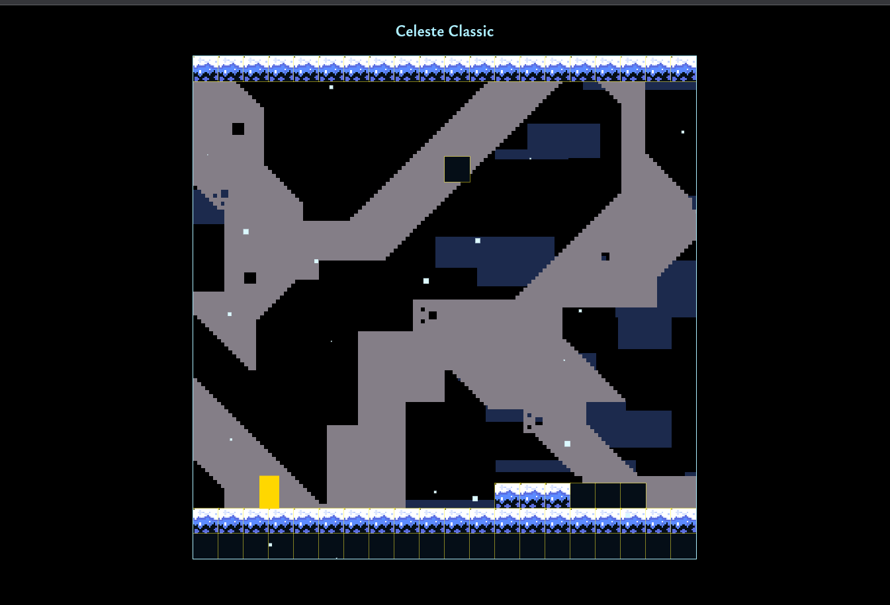

# Celeste classic My Version

This fun project to an attempt to clone [celeste classic](https://mattmakesgames.itch.io/celesteclassic) in javascript with a little bit of my own touches.

## Latest Progress

What it current can do.

# Project Roadmap 🚀 - Celeste's Classic Game Development

This roadmap outlines the steps and milestones for the development of a game inspired by Celeste. The project will involve designing game sprites, creating backgrounds, implementing level designs, and more. Follow along as we venture into uncharted territory, crafting an exciting gaming experience.

## Progress

- [x] Start Celeste's game sprites design
- [x] Build background
- [x] Work on level designs (Hint using arrays) - TO BE used for rapid-level design
- [ ] Work on character sprite and animation design
- [ ] Work on gameplay design - Character movement, special movements, rules for game over, keyboard movement, collision detection, and more... (To be broken down into smaller tasks)
- [ ] Break - Take a breather 😮‍💨
- [ ] Switching from one level to another
- [ ] Game over, scores, and first-level design
- [ ] Game menu design
- [ ] Animation refinements
- [ ] Move to module style
- [ ] Add some levels as examples
- [ ] License and readme updates
- [ ] Post on [my blog](https://www.notion.so/My-Portfolio-Update-805e0a494f9344318646ac65cabc3b6e?pvs=21) and start working on a Vlog to explain the code and thought process, similar to a tutorial
- [ ] Post on Twitter, Medium, YouTube, and my blog
- [ ] Break - Take a breather 😮‍💨
- [ ]Custom Level design UI. something like a table where you can visual design level then that is translated to the 1D array used to make the levels
- [ ] Write tests for the game (using Jest and Cypress)
- [ ] Set up CI/CD with Jenkins
- [ ] Work On Music of the game using [LMMS](https://lmms.io/)
- [ ] Host the game under my portfolio games section
- [ ] Typescript migration

## Embarking into the Uncharted

As we progress through this roadmap, we're venturing into uncharted territories of game development. Beyond these milestones lies a realm yet to unfold, beckoning the curious to tread where mystery and discovery intertwine.

Feel free to follow my journey, and stay tuned for updates on my [blog](https://medium.com/@edwinchebiikibet) and social media channels!

🚀 Let's create an amazing game together! 🎮
